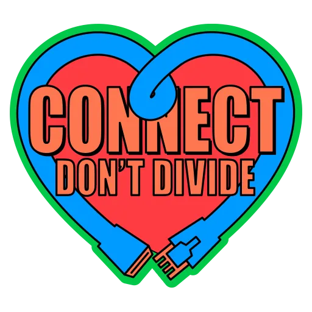

`✓ I am not a Robot.`

Hello Friend.

I'm a Systems Engineer by day, and a Systems Engineer by night.

I'm an often outspoken FOSS and Privacy Advocate and slayer of [Privacy Nihilism.](https://text.mainframe.computer/2020/10/05/Securi-tea-01.html)

I have an ethical and moral responsibility to those I love to push for a better future. I leave things better than I find them, and I will do the same for the internet. Nobody said the good fight was going to be easy, but I don't wear a wishbone where my backbone should be. `¯\_(ツ)_/¯` All bytes, no bark.

I endeavor to build ethical, open, and secure systems with every problem I solve (and prevent). I'm not old enough to know everything, and I'm not smart enough to build complicated systems.

Hunter S. Thompson said: "If you're going to be crazy, you have to get paid for it or else you're going to be locked up." So outside of turning my OCD into a career, I enjoy video/board games, music, hacking, homebrew (software +/- beer), gallows humor, rain on the roof, the fourth amendment, good movies, bad books, going all in, and anything that's honest.

If that's on brand for you, drop a line.
